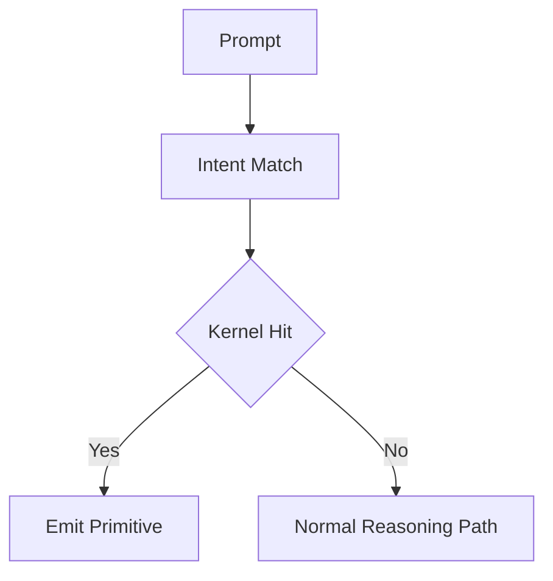

# ECOmpile

ECOmpile is a project in the R&D phase that aims to turn **self-assessing neural systems** (with a fair bit of HITL) into **hybrid neural‑code stacks**. The repository contains structured documentation and outlines SDK prototypes so the material can be shared as a cohesive public repository.

It's an AI refinery: models improvise, gather best outcomes and then forge those beneficial elements into lean code that can be inspected, accurately, swiftly and (cost-)effectively reproduced. The result is software that stays creative when it needs to be, yet behaves like dependable infrastructure where it counts, not to mention the gains in speed, reliability and the ability to educate, to define, display and reproduce certain actions in a clear, transparent manner.

Public stakeholders — from curious readers to CTOs — can explore this repository to understand why ECOmpile matters for cost, safety, transparency, sustainability, robust and reliable outcomes. 

> **All Rights Reserved — © 2025 Slavko Stojnić**

---

## Why this repo exists

- To inform stakeholders and provide a citation-friendly summary.
- To enlist backing for a high-potential, indispensible concept. 
- To document governance, a roadmap and SDK guidance so that the value of ECOmpile can be actualized.

## 5-Second Model



---

## Repository layout

```
.
├── README.md           # You are here
├── docs/               # Curated documentation layers
│   ├── overview.md
│   ├── architecture.md
│   ├── artifact_harvester_spec.md
│   ├── roadmap.md
│   ├── governance.md
│   ├── references.md
│   ├── openai_handoff.md
│   └── legal/
│       ├── IPCONFIG_PROOF.md
│       ├── IP_PROVENANCE_REGISTER.md
│       └── ...protocol records
├── cases/              # Raw interaction traces used for kernel compilation
│   └── 2026-03-04_unknown-contact-sid-removal/
│       └── conversation.md
├── kernels/            # Compiled deterministic kernels + fast index
│   ├── index.tsv
│   └── windows/acl/
│       └── SID_REMOVE_SYSTEM_WIDE_KNOWN.kernel.md
├── engine-concept/     # Routing logic notes
│   └── kernel-routing.md
├── REQUIREMENTS.lock   # Active implementation slice lock
├── CONTRIBUTING_KERNELS.md
├── sdk/                # Early SDK notes & executable examples
│   ├── README.md
│   └── examples/
│       ├── trace_capture_stub.py
│       ├── artifact_harvester_stub.py
│       ├── federated_pilot.py
│       ├── nesy_benchmark.py
│       └── openai_handoff_compiler.py
├── notes/              # Internal critique (gitignored)
└── .gitignore
```

---

## Reading order

1. **docs/overview.md** – Executive summary + terminology.
2. **docs/architecture.md** – Deep dive into the trace→code pipeline, with Mermaid diagrams and algorithm callouts.
3. **docs/artifact_harvester_spec.md** – First bounded harvesting spec for trait/failure/paired retrospection artifacts.
4. **docs/roadmap.md** – Delivery phases, milestones, and KPIs distilled from the source material.
5. **docs/governance.md** – Risk, compliance, and environmental framing.
6. **docs/references.md** – Citation list for every numeric claim surfaced in the curated docs.
7. **docs/public_release.md** – Single-file dossier ready for publication.
8. **cases/** + **kernels/** – Real case logs paired with compiled kernel artifacts.
9. **engine-concept/kernel-routing.md** – Intent→kernel routing and stop-condition model.
10. **sdk/examples/** – Lightweight Python references that illustrate trace capture, symbolic distillation, and benchmarking flows.
11. **docs/openai_handoff.md** – Outreach handoff package boundary (external evidence vs internal telemetry validation).
12. **docs/legal/** – IPClaim/IPConfig provenance and disclosure-date continuity records.

> **Diagram note:** GitHub renders the Mermaid diagrams inline, but if you need static images run `npx @mermaid-js/mermaid-cli -i docs/architecture.md -o diagrams/architecture.png` (or a similar `mmdc` command) and attach the PNGs to releases.

---

## Document provenance

- All derivative documents quote, summarize, or reorganize concepts but **never modify** the originals.
When referencing a section, the curated docs call out the line anchors (e.g., `1.md:285` for the public narrative).

---

## Case-to-Kernel Seed (New)

This repository now includes a concrete seed example of ECOmpile compilation:

1. **Raw case**:
- `cases/2026-03-04_unknown-contact-sid-removal/conversation.md`

2. **Compiled kernel**:
- `kernels/windows/acl/SID_REMOVE_SYSTEM_WIDE_KNOWN.kernel.md`

3. **Fast lookup index**:
- `kernels/index.tsv`

4. **Routing model**:
- `engine-concept/kernel-routing.md`

Contribution protocol:
- `CONTRIBUTING_KERNELS.md`

## Introspection Boundary

1. This repository compiles behavioral evidence and kernel candidates from case logs.
2. True model-internal introspection requires internal telemetry available only in host runtime infrastructure.
3. The OpenAI handoff package captures this boundary in `docs/openai_handoff.md`.

---

## License

Primary license artifact:
- `LICENSE-APC.md`

IPClaim/IPConfig provenance:
- `docs/legal/IPCONFIG_PROOF.md`
- `docs/legal/IP_PROVENANCE_REGISTER.md`

Disclosure-date continuity:
- original disclosure date still stands: 2025-11-08 (`README.md` first add in git history),
- current IPClaim linkage date: 2026-03-04.

Collaboration contact:
- stojnic.slavko@gmail.com

```
© 2025 Slavko Stojnić — All Rights Reserved.
No rights are granted to copy, modify, or distribute without explicit permission.
```
