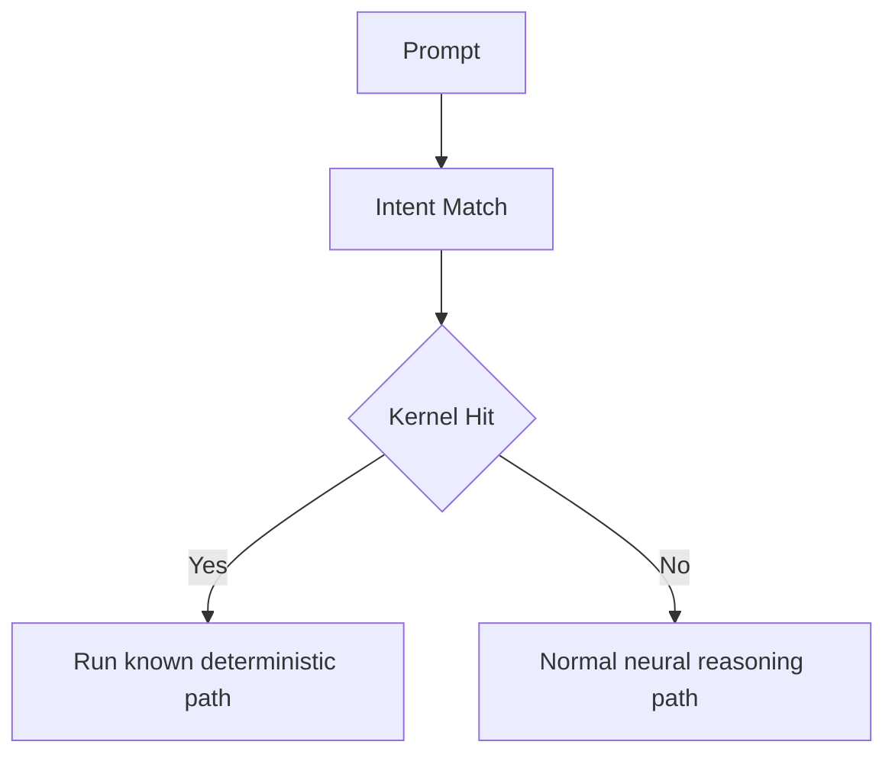

# ECOmpile

A model figures something out.

Then, next time, we make the model figure out the same thing again. And again. And again.

ECOmpile is my attempt to stop doing that where the useful part of the behavior has already become stable enough to turn into normal code.

The model can stay neural where it still needs to improvise. The repeatable part can become something deterministic, inspectable, testable and cheap to run.

That is the whole idea.

## The short version

Think of it as an AI refinery.

The model does the expensive messy work first. Useful repeated behavior gets identified. Stable parts get turned into code. Next time, the system checks whether there is already a known deterministic path before asking a giant neural system to rediscover the answer from scratch.

```mermaid
flowchart TD
    A[Prompt] --> B[Intent Match]
    B --> C{Kernel Hit}
    C -->|Yes| D[Run known deterministic path]
    C -->|No| E[Normal neural reasoning path]
```

That should buy several things at once when it works:

- less repeated inference
- lower compute cost
- more predictable behavior on known paths
- code you can inspect and test
- a clear place to teach/correct behavior instead of hoping the model rediscovers it correctly every time

The sustainability angle comes from the same place: if repeated neural work can be replaced safely by much cheaper deterministic execution, there should be real energy savings. I want that measured properly, not turned into green confetti.

## What exists right now

This is R&D. It is not a finished self-compiling AI platform.

The repo already contains:

- architecture and roadmap material
- a concrete case -> kernel seed
- a kernel index
- routing logic
- early SDK examples
- benchmark scaffolding
- provenance and handoff material
- governance / risk material

Current stage: **R&D prototype / bounded proof seeds**.

There is enough here to show the mechanism and build experiments around it. There is not enough here to claim the big system has already been proven.

## The useful next proof

The next thing I care about is painfully simple:

Take repeated real tasks.

Run them the expensive way.

Compile the stable part into a deterministic path.

Run them again.

Measure speed, compute, energy, accuracy, failure rate and when the system has to fall back to the model.

If the result is unimpressive, good, we learned something. If it is dramatic, even better.

## Where to look

- [Overview](docs/overview.md)
- [Architecture](docs/architecture.md)
- [Roadmap](docs/roadmap.md)
- [Governance](docs/governance.md)
- [Artifact harvester spec](docs/artifact_harvester_spec.md)
- [Public release dossier](docs/public_release.md)
- [Case material](cases/)
- [Compiled kernels](kernels/)
- [Routing model](engine-concept/kernel-routing.md)
- [SDK examples](sdk/examples/)

The repo also keeps the boundary explicit: true model-internal introspection needs host-runtime telemetry. What exists here works from observable behavior, traces and artifacts available outside the model internals.

## Why I am showing this publicly

Because I want people who actually run models, build AI infrastructure, benchmark systems, care about reliability, or care about energy use to look at the mechanism and tell me where it survives reality and where it does not.

If you can help test it, fund it, expose it to real workloads, or provide the runtime access needed for deeper experiments, I am interested.

## License / authorship

Primary license: [LICENSE-APC.md](LICENSE-APC.md)

Authorship/provenance material:

- [IPCONFIG_PROOF.md](docs/legal/IPCONFIG_PROOF.md)
- [IP_PROVENANCE_REGISTER.md](docs/legal/IP_PROVENANCE_REGISTER.md)

Contact: stojnic.slavko@gmail.com

[Support the work](https://ko-fi.com/earthcraft)
