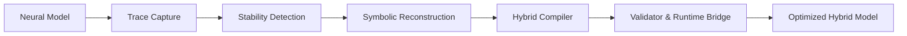

# ECOmpile Architecture

This brief reframes the pipeline described throughout `1.md` (`Technical Whitepaper`, `Implementation Brief`) and the integration notes inside `2.md`.

## System Overview

## Module Breakdown

### 1. Trace Capture Layer
- Hooks into transformer layers (PyTorch forward hooks / TensorFlow Trace API).
- Collects activations, gradients, attention maps, token probabilities.
- Produces **activation fingerprints** keyed by prompt, timestamp, and layer.

### 2. Stability Detection Engine
- Clusters repeated activation paths via DBSCAN / k-means.
- Computes stability score `S = 1 - σ(A) / (μ(A) + ε)` and flags segments with `S > 0.95`.
- Generates manifests (`sg_145.json`) enumerating layers, score, and sample contexts.

### 3. Symbolic Reconstruction Layer
- Applies symbolic regression (PySR, Eureqa, SymPy) or code LLMs to approximate subgraphs.
- Optimization objective: `f̂(x) = argmin_g E[||f(x) - g(x)||²]` for candidate functions `g`.
- Outputs pseudocode + tests (see `sdk/examples/trace_capture_stub.py`).

### 4. Hybrid Compiler
- Converts reconstructed routines into Python/C++/Rust modules via LLVM or Cython.
- Maintains ABI contracts so the neural runtime can hot-swap the compiled block.
- Metadata: version, checksum, dependency hints (e.g., `torch>=2.2`).

### 5. Validator & Runtime Bridge
- Compares neural vs. code outputs with `Δ = ||f(x) - f̂(x)|| / ||f(x)||`.
- Uses RLHF/counterfactual probes for OOD confidence.
- Routes inference through code path when confidence is high; otherwise falls back to neural block.

## Data & Telemetry

| Artifact | Purpose |
| --- | --- |
| Activation logs (`.nfrtrace`) | Raw tensors for offline reconstruction. |
| Stability manifests (`.nfrsg`) | Candidate subgraphs with scores & layer info. |
| Module registry (`modules.yml`) | Tracks compiled modules, versions, SHA-256 hashes. |
| Audit log (`audit.log`) | Immutable record of swaps for compliance (ISO/IEC 42001). |

## KPIs

- **Deterministic coverage**: % of inference tokens served by hardened code.
- **Energy per task**: Should drop toward CPU-only benchmarks (~0.004 kWh/task).
- **Hallucination incidence**: Target <5% on QA / reasoning suites.
- **Fallback rate**: Share of requests reverting to neural path (indicator of drift).

## Extensibility

- Multimodal support: run trace capture independently on text, vision, and audio encoders before merging symbolic routines.
- Federated deployments: push symbolic distillation to edge devices using the approach prototyped in `sdk/examples/federated_pilot.py`.
- Quantum-assisted clustering: experiments mentioned in `2.md` propose annealing-based search for extremely large models.

For implementation guidance, see `sdk/README.md`.
